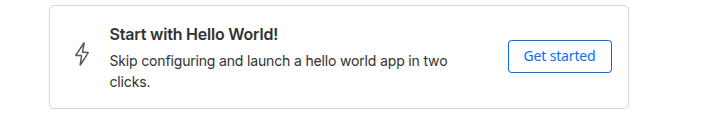
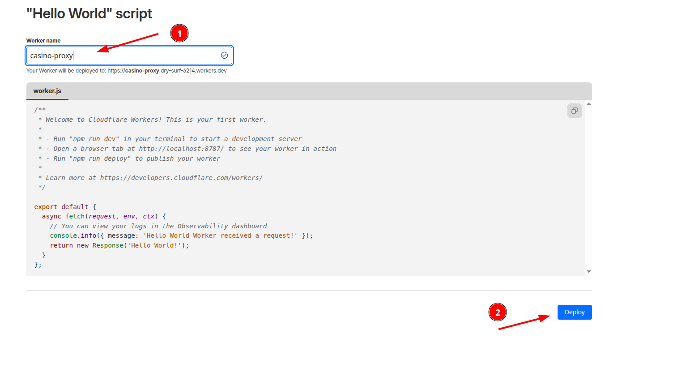
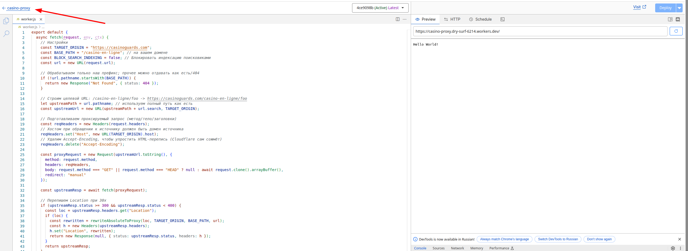
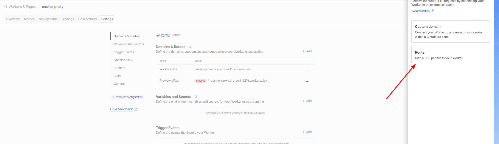

# Cloudflare Worker - Proxy для Casino

Этот Worker проксирует контент с `https://casinoguards.com/casino-en-ligne/*` на ваш домен с автоматической перезаписью всех ссылок и блокировкой индексации.

## Развёртывание вручную через веб-интерфейс

### Шаг 1: Войдите в Cloudflare Dashboard
1. Перейдите на https://dash.cloudflare.com/
2. Войдите в свой аккаунт

### Шаг 2: Создайте новый Worker
1. В левом меню выберите **Workers & Pages**
2. Нажмите кнопку **Start with Hello World!**



3. Дайте имя вашему Worker (например, `casino-proxy`)



5. Нажмите **Deploy**

### Шаг 3: Вставьте код
1. После создания нажмите **Edit code** (или **Quick edit**)


2. Удалите весь стандартный код в редакторе
3. Скопируйте весь код из файла `worker.js` и вставьте в редактор
4. Нажмите **Save and Deploy** (или **Deploy**)


### Шаг 4: Настройте Custom Domain
1. Вернитесь на страницу Worker

2. Перейдите на вкладку **Settings** → **Domains & Routes**

3. В разделе **Domains & Routes** нажмите **Route**

4. Введите route (например, `thenationonlineng.net/casino-en-ligne/*)

5. Нажмите **Add Route**

## Настройки Worker

В файле `worker.js` можно настроить следующие параметры:

```javascript
const TARGET_ORIGIN = "https://casinoguards.com"; // Источник контента
const BASE_PATH = "/casino-en-ligne"; // Префикс на вашем домене
const BLOCK_SEARCH_INDEXING = false; // Блокировка индексации поисковиками
```

## Что делает Worker

- ✅ Проксирует контент с `https://casinoguards.com/casino-en-ligne/*`
- ✅ Переписывает все ссылки (href, src, action) на ваш домен
- ✅ Обрабатывает srcset для адаптивных изображений
- ✅ Переписывает URL в CSS файлах
- ✅ Корректно обрабатывает cookies (меняет Domain)
- ✅ Обрабатывает редиректы (30x)
- ✅ Блокирует индексацию поисковиками:
  - Добавляет мета-тег `<meta name="robots" content="noindex, nofollow">`
  - Добавляет заголовок `X-Robots-Tag: noindex, nofollow`
- ✅ Удаляет защитные заголовки (CSP, X-Frame-Options) для корректного встраивания

## Тестирование

После развёртывания проверьте:
- `https://thenationonlineng.net/casino-en-ligne` - должен показать контент с casinoguards.com
- Все ссылки должны вести на ваш домен, а не на исходный
- В исходном коде страницы не должно быть упоминаний `casinoguards.com`

## Обновление Worker

При изменении кода в `worker.js`:

**Через веб-интерфейс:**
1. Откройте Worker в Dashboard
2. Нажмите **Quick Edit**
3. Вставьте обновлённый код
4. Нажмите **Save and Deploy**
