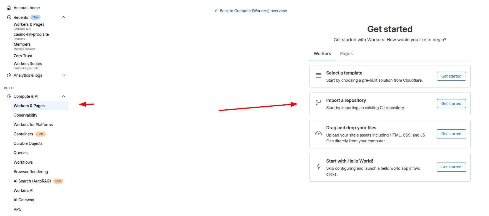
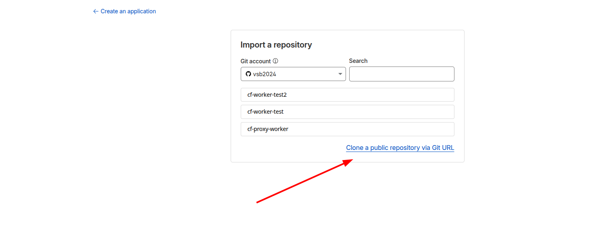
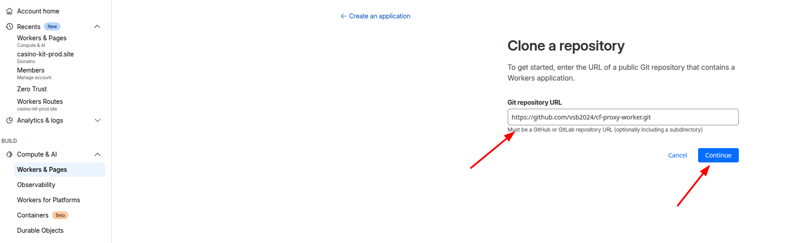
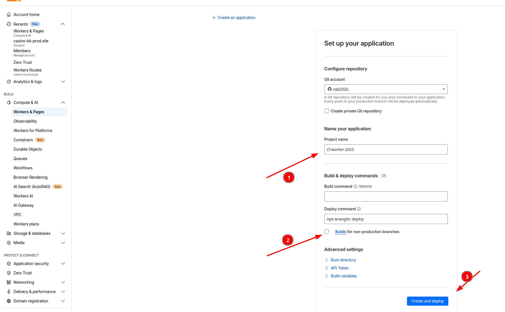

### Step 1: Log in to Cloudflare Dashboard
1. Go to https://dash.cloudflare.com/
2. Log in to your account

### Step 2: Create a New Worker
1. In the left menu, select **Workers & Pages**
2. Click the **Import a repository!** button

3. Click the *Clone a public repository via Git URL!** 

4. Enter the repository URL: `

5. Click **Create and deploy**
