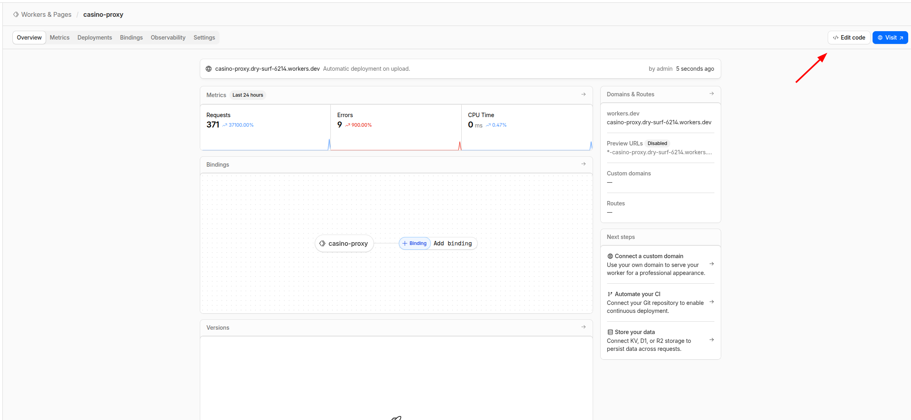
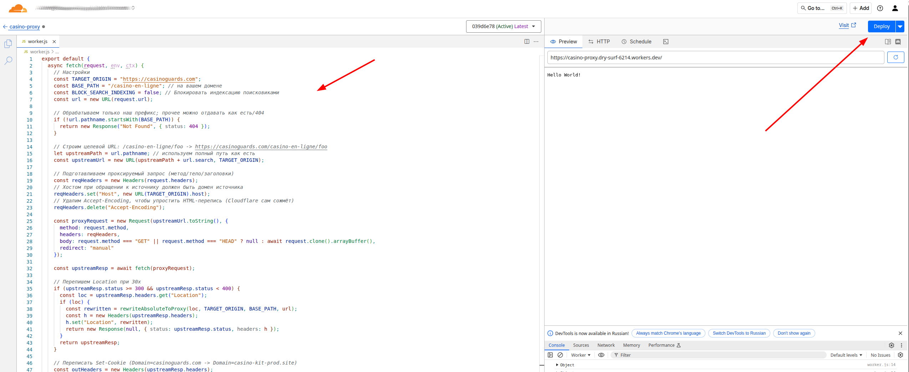
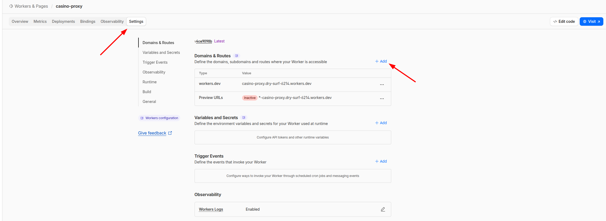
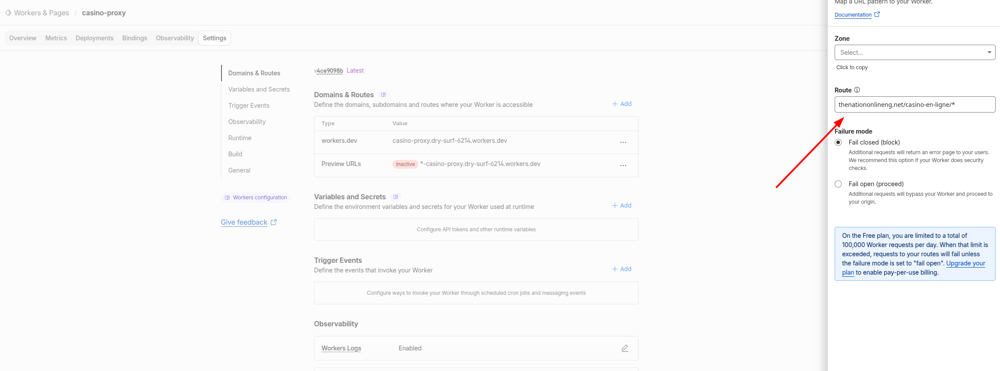

# Cloudflare Worker - Casino Proxy

This Worker proxies content from `https://casinoguards.com/casino-en-ligne/*` to your domain with automatic rewriting of all links and search indexing blocking.

## Manual Deployment via Web Interface

### Step 1: Log in to Cloudflare Dashboard
1. Go to https://dash.cloudflare.com/
2. Log in to your account

### Step 2: Create a New Worker
1. In the left menu, select **Workers & Pages**
2. Click the **Start with Hello World!** button


3. Give your Worker a name (e.g., `casino-proxy`)


5. Click **Deploy**

### Step 3: Insert Code
1. After creation, click **Edit code** (or **Quick edit**)



2. Delete all the default code in the editor
3. Copy all code from the `worker.js` file and paste it into the editor
4. Click **Save and Deploy** (or **Deploy**)




### Step 4: Configure Custom Domain
1. Return to the Worker page

2. Go to the **Settings** → **Domains & Routes** tab

3. In the **Domains & Routes** section, click **Route**

4. Enter the route (e.g., `thenationonlineng.net/casino-en-ligne/*)

5. Click **Add Route**

## Worker Settings

In the `worker.js` file, you can configure the following parameters:

```javascript
const TARGET_ORIGIN = "https://casinoguards.com"; // Content source
const BASE_PATH = "/casino-en-ligne"; // Prefix on your domain
const BLOCK_SEARCH_INDEXING = false; // Block search engine indexing
```

## What the Worker Does

- ✅ Proxies content from `https://casinoguards.com/casino-en-ligne/*`
- ✅ Rewrites all links (href, src, action) to your domain
- ✅ Processes srcset for responsive images
- ✅ Rewrites URLs in CSS files
- ✅ Correctly handles cookies (changes Domain)
- ✅ Handles redirects (30x)
- ✅ Blocks search engine indexing:
  - Adds meta tag `<meta name="robots" content="noindex, nofollow">`
  - Adds header `X-Robots-Tag: noindex, nofollow`
- ✅ Removes security headers (CSP, X-Frame-Options) for proper embedding

## Testing

After deployment, verify:
- `https://thenationonlineng.net/casino-en-ligne` - should display content from casinoguards.com
- All links should point to your domain, not the original
- The page source code should not contain any mentions of `casinoguards.com`

## Updating the Worker

When changing code in `worker.js`:

**Via web interface:**
1. Open the Worker in Dashboard
2. Click **Quick Edit**
3. Paste the updated code
4. Click **Save and Deploy**
